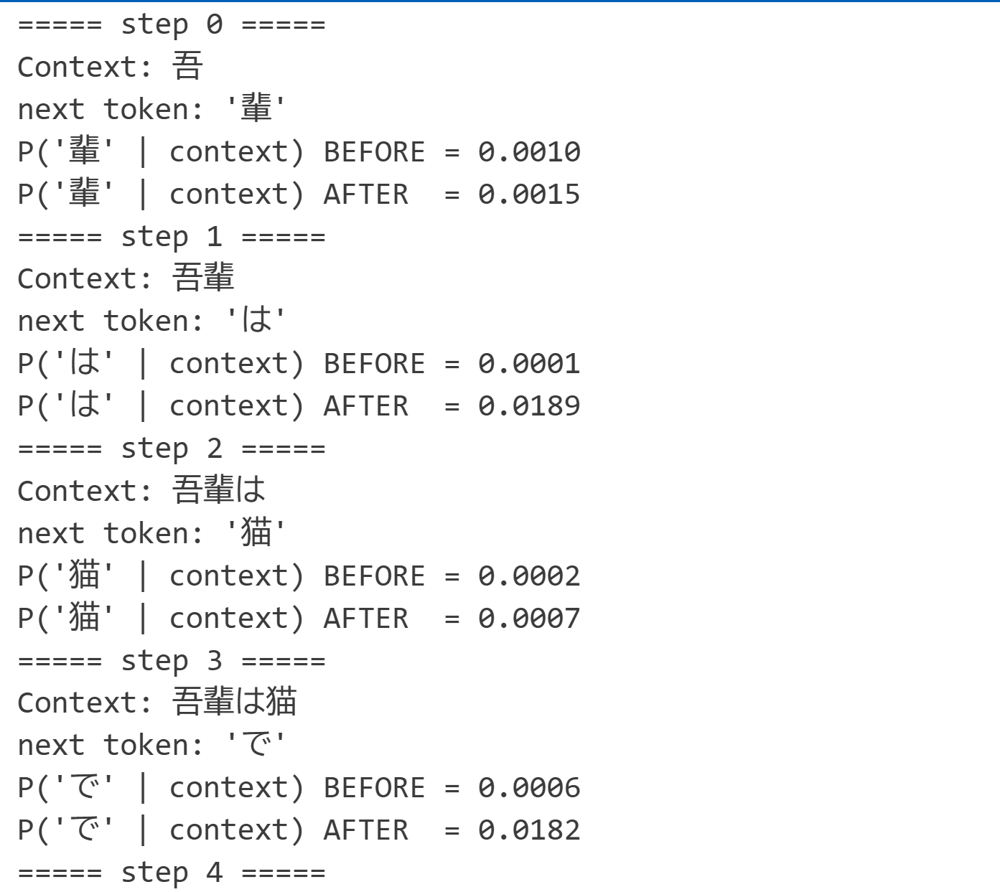

# GPT(Transformer)の実装

このリポジトリでは、Transformer（Decoder-only）モデルを、  
PyTorch を用いて 実装しています。

実験用として非常に小さなデータセットを使い、  
仕組みの理解・内部構造の把握を目的にした実装になっています。

## 特徴

- **Masked Self-Attention**  
  GPT 系の次トークン予測タスクを再現。

- **Positional Embedding**  
  シーケンス内のトークン位置情報を学習可能埋め込みで表現。

- **Multi-Head Attention**  
  複数ヘッドで異なる特徴を学習。


## 技術スタック

- **Docker / Devcontainer**  

- **Python 3.14**

- **uv**  
  Python依存管理ツール（高速・軽量）。

- **PyTorch**  
  モデル構築・学習フレームワーク。


## 使い方

### 1. クローン

### 2. Devcontainer で環境構築

VSCode の Dev Containers を使用すると、自動で必要な依存がインストールされます。

### 3. 学習データの配置

学習データを `decoder/input.txt` に保存してください。

### 4. トレーニング

Jupyter Notebook で実行できます：

```
decoder/train.ipynb
```


## モデル構造

```
MiniGPT
├── Token Embedding
├── Positional Embedding
├── DecoderBlock × N
│      ├── LayerNorm
│      ├── Masked Multi-Head Attention
│      ├── Add & Norm
│      ├── Feed Forward Network
│      └── Add & Norm
└── Linear Head 
```

## 学習前と学習後の比較

次のトークン予測における **確率分布の変化**を示す画像です。



## 補足

* このモデルは **GPT-2 の簡易版**です。
* 本番レベルの性能を狙うためではなく、
  **Transformer の内部構造を理解するための学習用コード**です。
